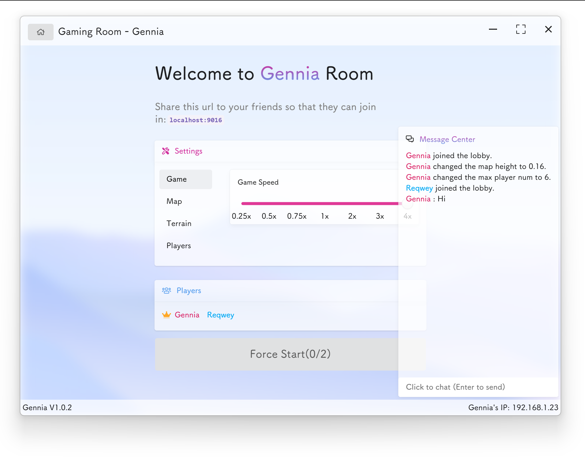
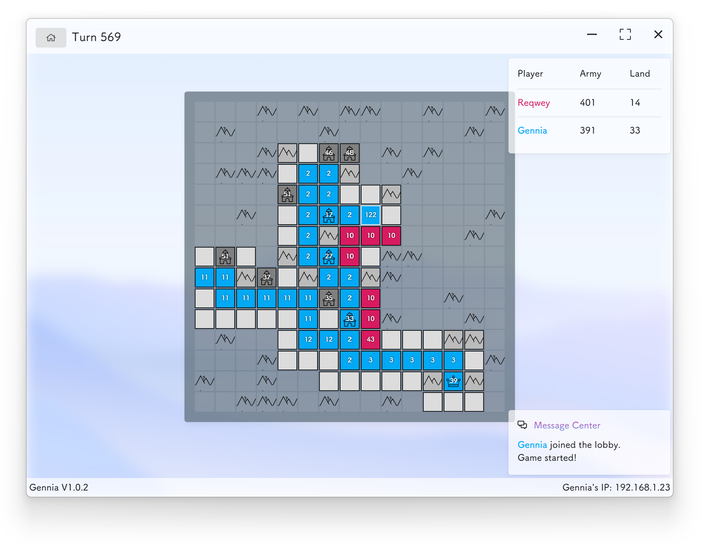

<h1 align="center">
  
   
  Gennia
</h1>

> Yet another portable generals.io server & client

## Todo

* Port changements
* Map editor
* [Solved]~~Add cache queue for player's input to improve gaming performance~~
* Can add bots for the game
* i18n support
